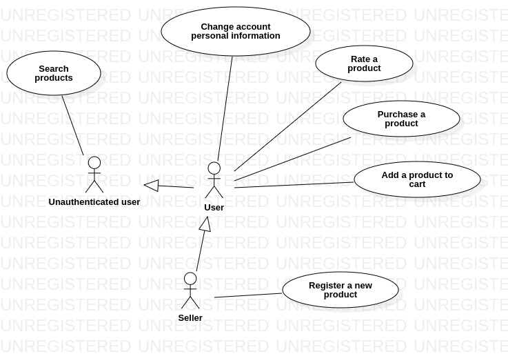

# Loja node

## Ferramentas utilizadas
* [Star UML](https://staruml.io/) para criar os diagramas da UML.
* [MySQL Workbench](https://www.mysql.com/products/workbench/) para modelar as tabelas do banco de dados relacional.

## Diagrama de casos de uso

### Atores
* Usuário não autenticado: usuário que não está autenticado no sistema.
* Usuário: usuário autenticado no sistema.
* Vendedor: usuário que pode vender um produto na loja.

## Fluxo de desenvolvimento
O fluxo de desenvolvimento é baseado no [gitflow](https://www.atlassian.com/git/tutorials/comparing-workflows/gitflow-workflow).

### Criando numa nova funcionalidade
* Crie um novo branch a partir do branch "development" com o prefixo "feature/"
* Desenvolva a funcionalidade.
* Envie a funcionalidade desenvolvida para o repositório remoto.
* Abra um pull request do branch que contém a funcionalidade desenvolvida para o branch "development".
* Após a revisão de código, se nenhum error foi encontrado, o merge é realizado para o branch "development".

### Lançando uma nova versão
* Após um certo número de funcionalidades adicionadas ao branch "development", crie um novo branch com o prefixo "release/"
* Abra um pull request do branch "release/" para o branch master.

O branch "release/" deve ter a versão a ser lançada em seu nome, ex: release/v0.1

## Tabelas do banco de dados relacional
