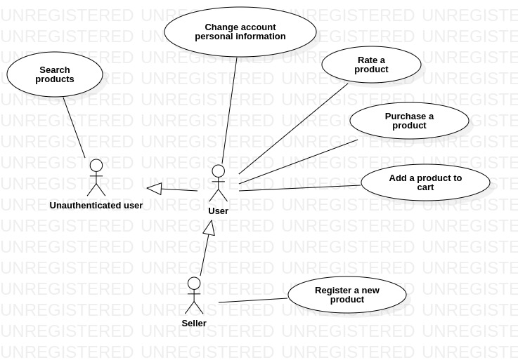
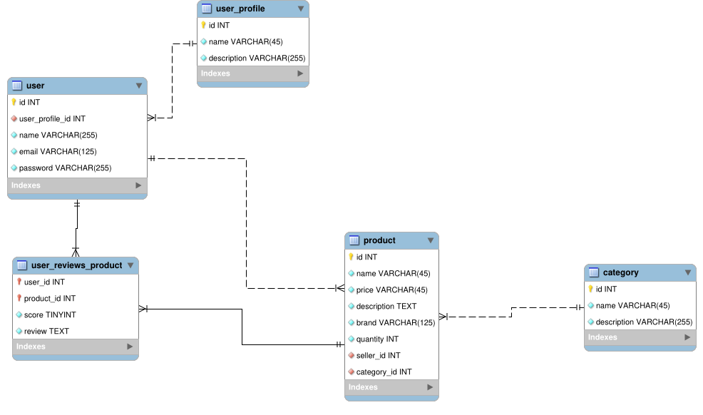

# Node store

## Tools used
* [Star UML](https://staruml.io/) to create UML diagrams.
* [MySQL Workbench](https://www.mysql.com/products/workbench/) to model the relational database schema.
* [NPM](https://www.npmjs.com/) to manage node's packages.

## Use case diagram

### Actors
* Unauthenticated user: user that is not logged in.
* User: user that is logged in.
* Seller: user that can sell a product on the store.

## Development workflow
The workflow is based on [gitflow](https://www.atlassian.com/git/tutorials/comparing-workflows/gitflow-workflow).

### Creating a new feature
* Create a new branch from the "develop" branch with the prefix feature/.
* Develop the feature.
* Push the feature into the remote repository.
* Open a pull request from the feature/ branch to the "develop" branch.
* After the review, if no errors are found, the branch is merged to the "develop" branch.

### Creating a new release
* After merging many features into the develop branch, create a new branch with the prefix release/
* Merge the release/ branch with master.

The release/ branch should have it's version as a name, e.g: release/v0.1

## Relational Database tables

