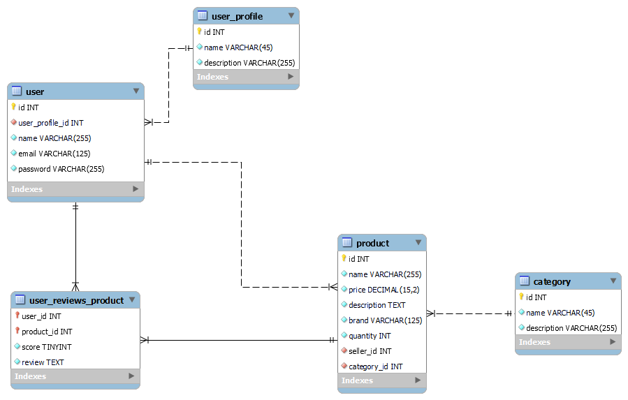

# Node store

## Tools used
* [Star UML](https://staruml.io/) to create UML diagrams.
* [MySQL Workbench](https://www.mysql.com/products/workbench/) to model the relational database schema.

## Use case diagram

### Actors
* Unauthenticated user: user that is not logged in.
* User: user that is logged in.
* Seller: user that can sell a product on the store.

## Development workflow
The workflow is based on [gitflow](https://www.atlassian.com/git/tutorials/comparing-workflows/gitflow-workflow).

### Creating a new feature
* Create a new branch from the "develop" branch with the prefix feature/.
* Develop the feature.
* Push the feature into the remote repository.
* Open a pull request from the feature/ branch to the "develop" branch.
* After the review, if no errors are found, the branch is merged to the "develop" branch.

### Creating a new release
* After merging many features into the develop branch, create a new branch with the prefix release/
* Merge the release/ branch with master.

The release/ branch should have it's version as a name, e.g: release/v0.1

## Relational Database tables

## How to run the docker image
(This section is not complete, the docker commands are not gonna work yet).

Execute the following commands inside the this project's directory (do not confuse with the /src/project folder!).

Build the image: ``docker build -t node-store:latest --build-arg DEFAULT_PORT=3000 .``

### Development specific commands

Run the container: ``docker run -d --name node-store-dev --env environment=development jwtSecret=djsao2oi32f -p 3000:3000 -v $(pwd):/node-store node-store:latest``

P.S: **If you are using windows** change the ``-v $(pwd):/node-store`` for ``-v "%cd%":/node-store``

### Production/Homologation specific commands

Run the container: ``docker run -d --name node-store --env environment=production jwtSecret=djsao2oi32f -p 3000:3000 node-store:latest``

### Values for the environment variables
**environment:** can be "developemnt", "homologation" or "production".

**jwtSecret:** any random string value.